---
format:
  html:
    toc: false
repo-actions: false
---
<!-- Password to open pdf books: 08081968 -->
<link rel="preconnect" href="https://fonts.googleapis.com">
<link rel="preconnect" href="https://fonts.gstatic.com" crossorigin>
<link href="https://fonts.googleapis.com/css2?family=Cabin+Sketch:wght@400;700&display=swap" rel="stylesheet">

  
Geology and Full Stack WebGIS

  I work with these tools

<a href="https://qgis.org/" target="_blank" rel="noopener noreferrer">
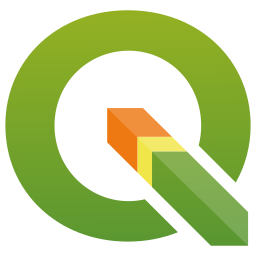
</a>
<a href="https://grass.osgeo.org/" target="_blank" rel="noopener noreferrer">
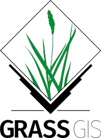
</a>

<a href="https://geemap.org/" target="_blank" rel="noopener noreferrer">
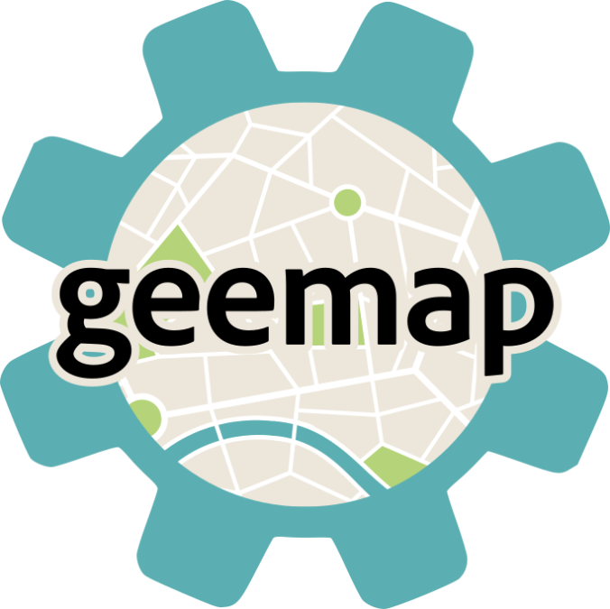
</a>
<a href="https://leafmap.org/" target="_blank" rel="noopener noreferrer">
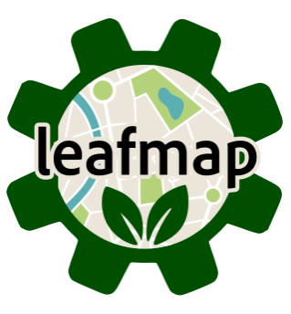
</a>

<a href="https://www.docker.com/" target="_blank" rel="noopener noreferrer">
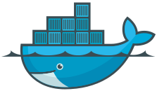
</a>

  
for exploring Earth to uncover the unknown

 

What I do

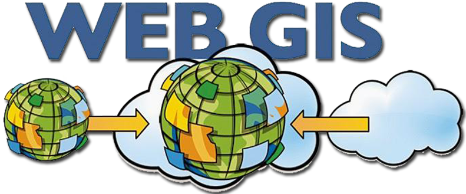
WebGIS Applications

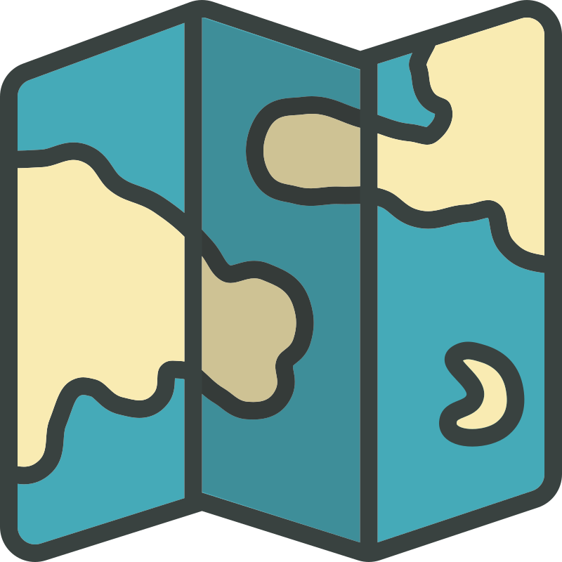
Cartography

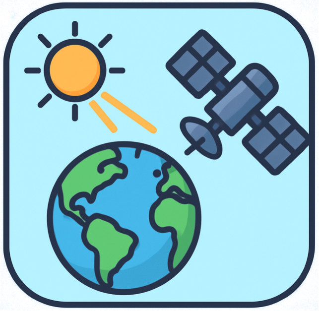
Remote Sensing

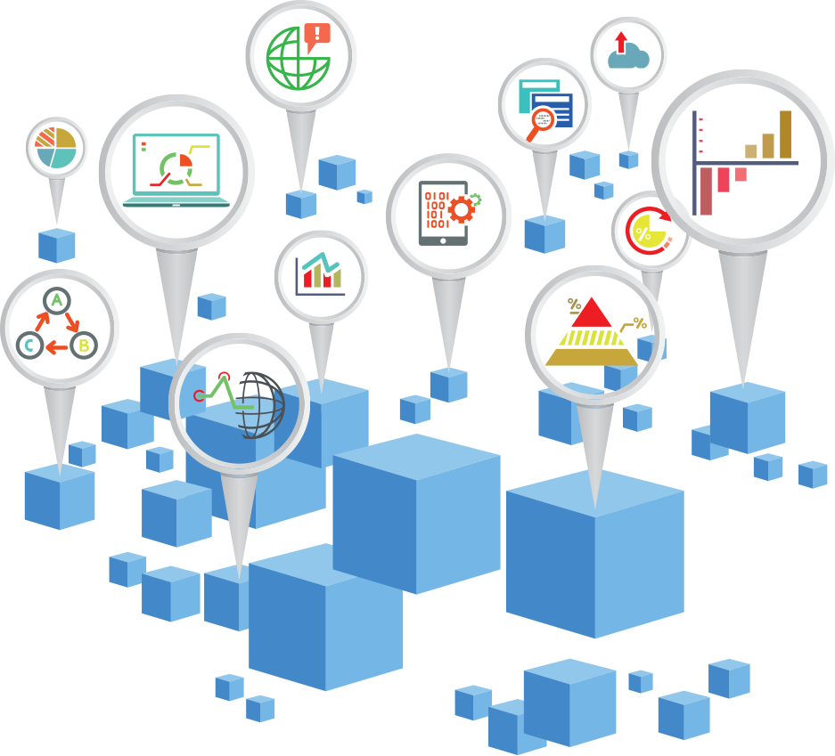
Geodata Analysis

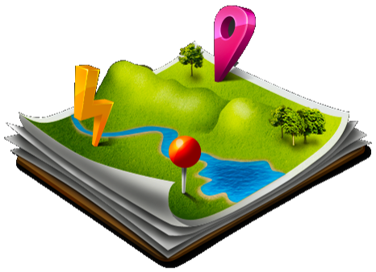
Geospatial Analysis

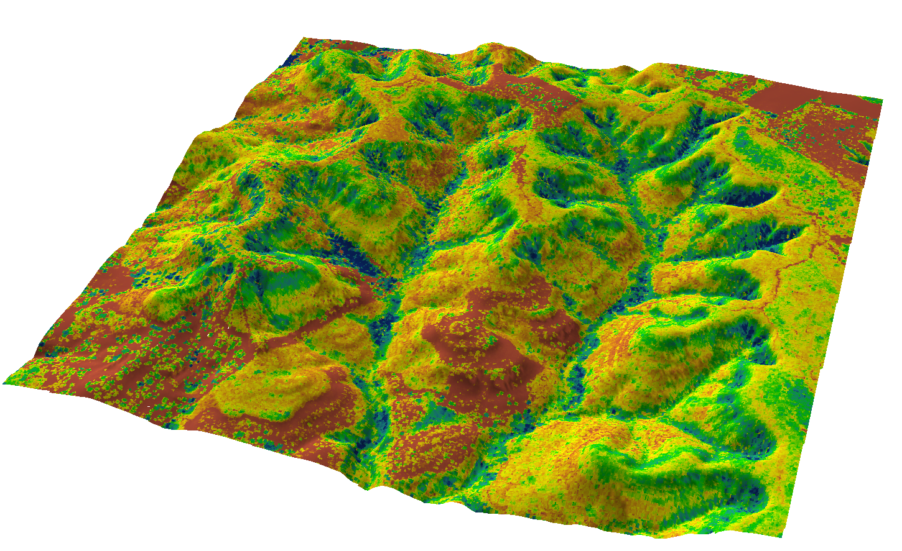
GIS Mapping

Geolocation Apps

WebGIS Applications

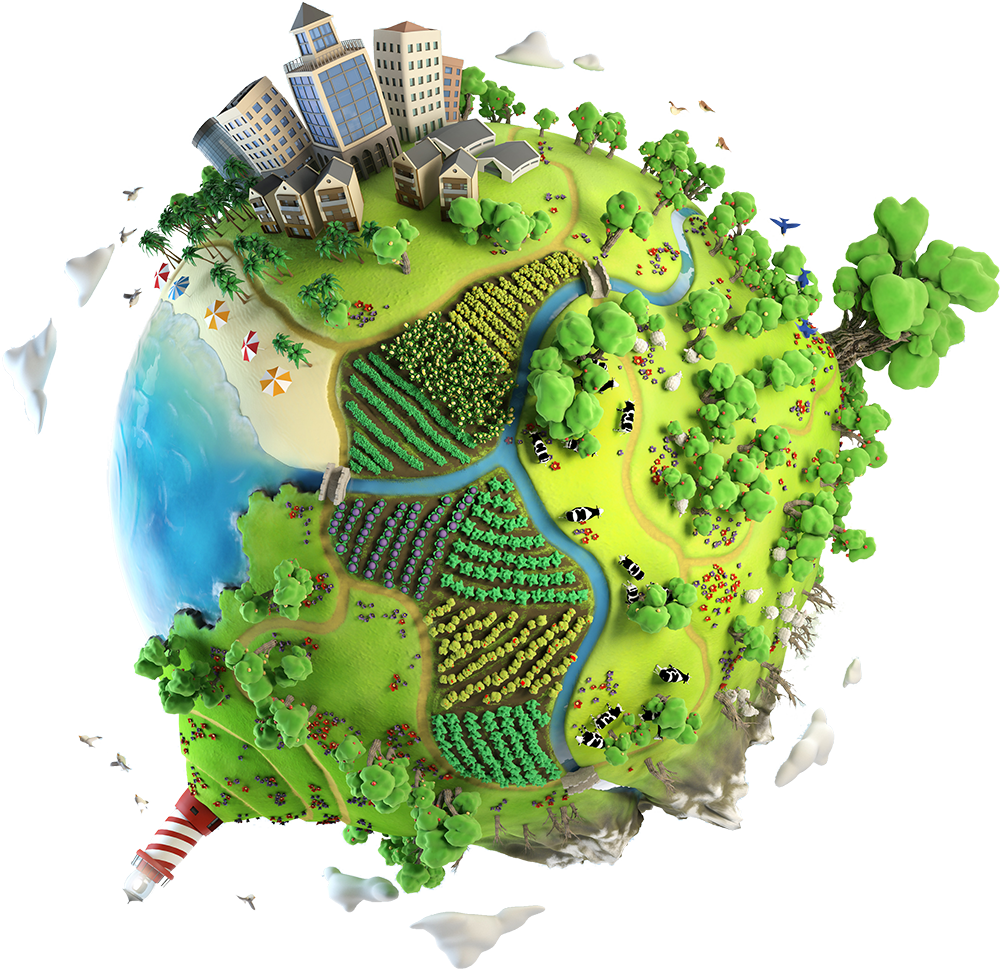
GIS Ecology

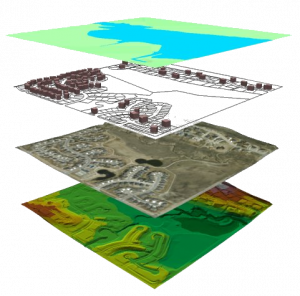
GIS and Geology integration

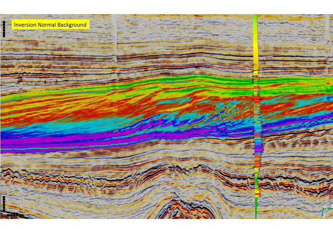
2D & 3D Seismic Interpretation

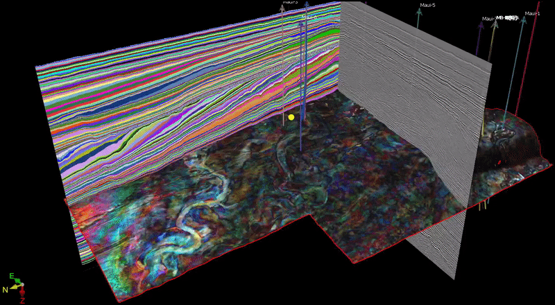
Seismic Attributes

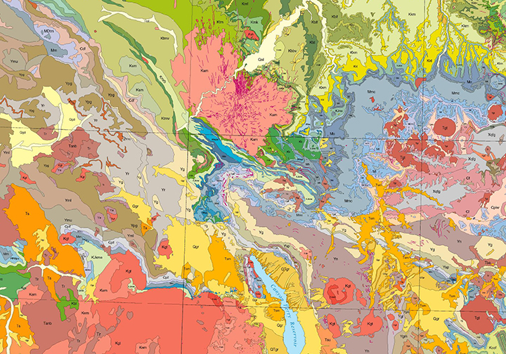
Geological Mapping

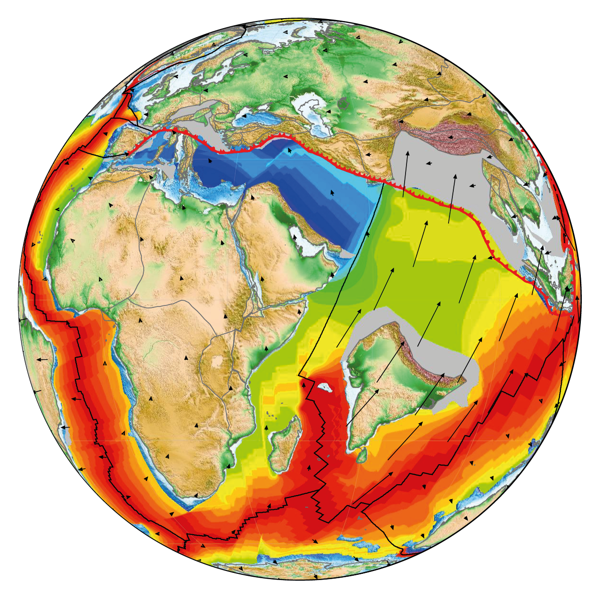
Paleogeographic Mapping

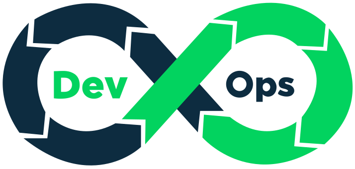
DevOps

<a href="about/about-this-me.html" class="bottom-about-services">click here if you want to learn more about me</a>

