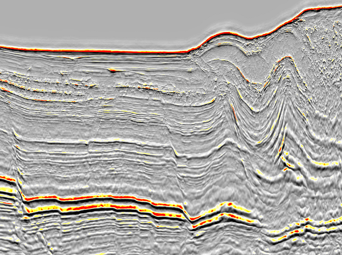
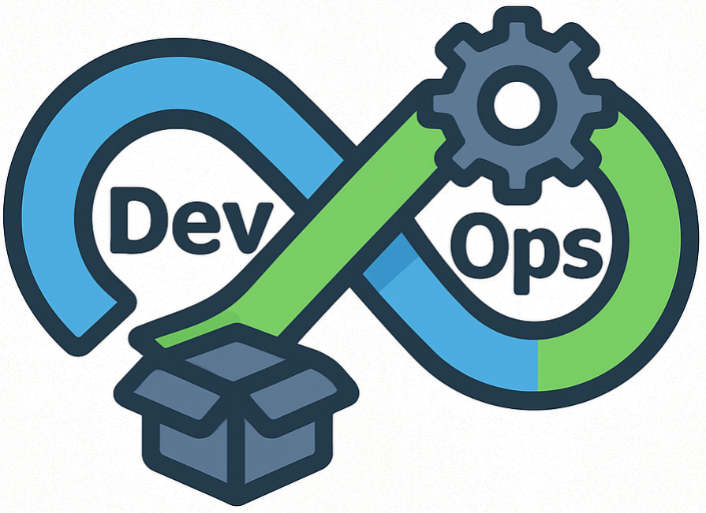

---
format:
  html:
    toc: false
repo-actions: false
---
<!-- Password to open pdf books: 08081968 -->
<link rel="preconnect" href="https://fonts.googleapis.com">
<link rel="preconnect" href="https://fonts.gstatic.com" crossorigin>
<link href="https://fonts.googleapis.com/css2?family=Cabin+Sketch:wght@400;700&display=swap" rel="stylesheet">

  
Geology and Full Stack WebGIS

  I am using these tools

  
for exploring Earth to uncover the unknown

 

What I do

Cartography

Remote Sensing

Geodata Analysis

Geospatial Analysis

GIS Mapping

Geolocation Apps

GIS Ecology

GIS and Geology integration

2D & 3D Seismic Interpretation

Paleogeographic Mapping

DevOps

